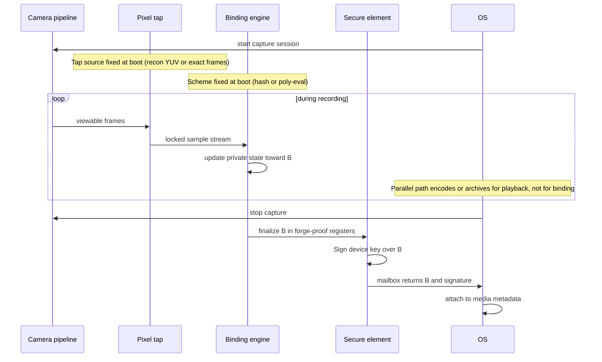
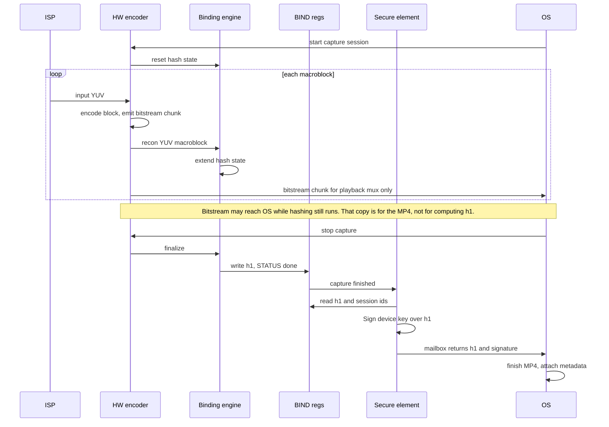
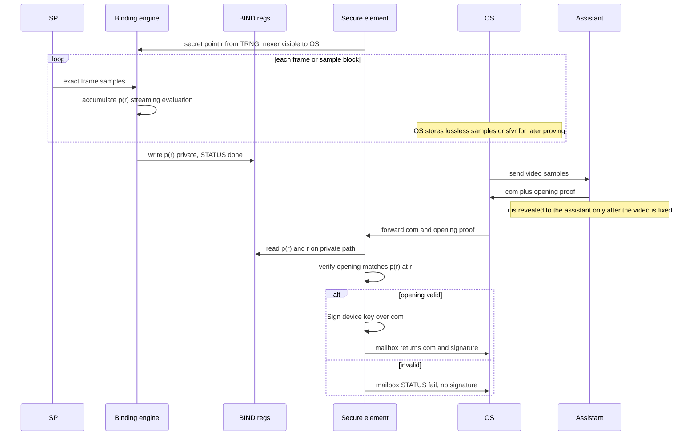
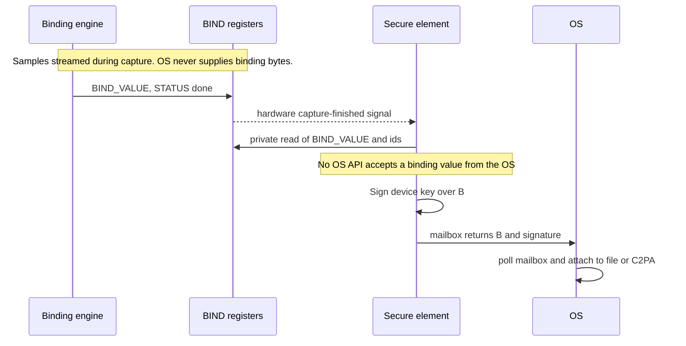

# Hardware requirements: capture binding engine and secure-element signing

## Goal of this document

Define a **general camera-side architecture** for securely binding a recording to a short value the device can sign, so that later off-device zero-knowledge proofs of video edits can rely on that signature.

The architecture should fit today’s proof stacks (Eva, zk-Cinema) and, as far as possible, **new edit-proof systems that appear later without requiring a new silicon spin**. Ideal outcome: new ZKPs reuse the same silicon — a locked pixel tap into one binding engine — and only need new configuration, not a redesigned SoC.

Concretely, the hardware exposes two choices that are locked before the OS runs (not free for apps to change mid-capture):

1. **Which pixels to feed the binding engine** (`PIPE_ID` / input mux): e.g. encoder reconstruction YUV vs exact pre-encode frames.  
2. **How the binding engine turns those pixels into the short value `B`** (`SCHEME_ID`): e.g. a ZK-friendly hash vs a polynomial-evaluation / commitment scheme.

Eva vs zk-Cinema is exactly that: different mux setting + different scheme, same block diagram. A future proof system should preferably be “just another supported tap + scheme,” not a one-off custom IP block. Only if it needs a tap or algorithm the engine physically cannot do would you need new silicon.

Eva and zk-Cinema are worked examples (Profile A and Profile B), not the only intended consumers.

## Binding

**Binding** means: produce a short value `B` that is cryptographically tied to the pixels of *this* recording, then have the device private key sign only that value.

Without binding, a signature only proves “some blob was signed by this device key.” An attacker who controls the app can invent pixels (or a digest) and still get a valid signature. With binding, the signature proves “these pixels flowed through the camera hardware path we locked down,” because:

1. Hardware streams the real pixel samples into the **binding engine**.  
2. The binding engine’s output `B` (the binding value) lives in registers the OS cannot overwrite.  
3. The secure element signs `B` (or a value checked against hardware state) and refuses OS-chosen digests.

`B` is the **binding value** (today: a hash digest `h1`, or a polynomial commitment `com`). The pair `(B, σ)` is what later edit proofs attach to.

**Capture** here means one recording session: from “start recording” to “stop recording” on the device (one clip / one session id). Binding and signing happen for that session, while or as soon as the session ends — not by later re-reading a file from ordinary storage and hashing it.

---

## Profiles (examples)

- **Profile A — Eva-style hash binding.** A ZK-friendly hash over the encoder’s **reconstruction YUV** produces a digest `h1`; the SE signs `h1`. Later edit proofs use macroblock pixel witnesses regenerated by decoding the normal MP4.
- **Profile B — zk-Cinema-style polynomial-commitment binding.** The binding value is a **polynomial commitment** `com` to the exact frame samples (optionally also to sfvr frame deltas). The heavy commitment computation can be outsourced to an untrusted assistant; on-device hardware only needs to **stream-evaluate** the video polynomial at a secret random point and verify the assistant’s opening before the SE signs `com`. If the device computes `com` itself, the opening check is unnecessary (see §4).

### Shared skeleton



1. **Camera pipeline** produces viewable frames (sensor → ISP → YUV or other sample format).  
2. A locked hardware **pixel tap** feeds the binding engine. Which samples are tapped is selected by the input mux / `PIPE_ID` (profile config).  
3. A **binding engine** streams those samples and produces the binding value `B` (hash digest, polynomial-related value, or a future scheme selected by `SCHEME_ID`). Intermediate working state may live in private registers until finalize.  
4. A **secure element (SE)** signs only hardware-produced (or hardware-checked) binding values.  
5. The OS stores what playback and later proving need (lossy MP4, lossless archive, sfvr, …) and attaches `(B, σ)` as metadata.

**Where does hardware encode fit?** Most camera SoCs already include an H.264/HEVC encoder that shrinks frames into a small MP4 for playback. That encode step is **optional for the binding architecture**: the binding engine only needs a locked tap onto *some* pixel stream. Encode matters when you choose **which** stream to tap:

- **Reconstruction (recon)** — While encoding, the hardware encoder does not only emit a compressed bitstream. For each block it also builds a local decoded version of that block (the samples it would get if it decoded what it just encoded). Those samples are the **reconstruction**. They exist so the encoder can predict later blocks; for a conformant stream they match what a normal decoder will output from the MP4. Profile A taps **recon** and hashes it during encode. Then you only need to keep the small MP4: decode later → same pixels the hash saw.
- **Exact frames** — Profile B taps the viewable frames **before** lossy encode (or an equivalent lossless path). Encode may still run in parallel to make a playback MP4, but that MP4 is **not** what was bound: proofs need the exact samples (or signed sfvr deltas), so storage is larger.

So: encode is common hardware; Profile A uses it as the source of recon pixels and as the small archive; Profile B does not bind through the encoder.

**At the end of a capture session**, produce `(B, σ)` such that:

1. `B` is bound to pixels that flowed through fixed hardware during that session, in the pixel domain the proof system uses.  
2. `σ` is a signature under the device private key over `B` (plus session metadata).  
3. Ordinary software cannot invent `B`, cannot ask the signer to sign a fake binding value, and never sees the private key.

## Profile comparison

| | **Profile A (Eva)** | **Profile B (zk-Cinema)** |
|---|---|---|
| Pixel tap | Encoder **reconstruction** YUV (local decode loop) | **Exact frame samples** the proofs will use (pre-encode / lossless domain); optionally also frame deltas (sfvr) |
| Binding engine | Streaming ZK-friendly hash → `h1` | Streaming polynomial evaluation `p(r)` at a secret random point `r`; commitment `com` computed by an untrusted **assistant** and checked against `p(r)` (or computed on-device) |
| What the SE signs | `h1` | `com` (after opening check if assistant is used) |
| Witnesses for later proofs | Regenerated by **decoding the MP4** (recon = conformant decoder output) | The **exact samples** must be retained (lossless archive or signed sfvr deltas); the lossy MP4 alone cannot regenerate them |
| On-device storage cost | Normal MP4 | Considerably higher (lossless-class) |

**Why reconstruction in Profile A (storage tradeoff):**  
Lossy encode **throws away information**: you cannot recover the exact pre-encode ISP frames from the MP4. By binding to **recon** (defined above) instead, Profile A accepts that lossy domain and gains ordinary MP4-sized storage for later proofs. Hashing runs in one shot during encode; no second “decode the file then hash” pass on the device.

**Why exact samples in Profile B:**  
zk-Cinema circuits operate on plain per-channel pixel matrices and do not run a lossy codec in-circuit. The signed commitment must bind the exact sample values the prover will later use, which the device has to keep (losslessly) or represent as signed sfvr deltas. A playback MP4 alone is not enough.

**Glossary**

| Term | Meaning |
|------|---------|
| **Binding** | Tying a short signed value to the pixels of this capture session via a locked hardware path (see above). |
| **Binding value `B`** | The short value the SE signs: hash digest `h1` (Profile A) or polynomial commitment `com` (Profile B). |
| **Capture / capture session** | One recording from start to stop (one clip); binding and attest apply to that session. |
| **Reconstruction (recon)** | YUV samples the encoder computes after coding each block (its local decode). Same domain a conformant decoder outputs for that bitstream. |
| **Binding engine** | Fixed-function circuit that streams tapped samples and produces the binding value `B` (and any private intermediate state). Delivered as hardware IP the SoC vendor integrates. Configurable by input mux / `PIPE_ID` (which pixels) and `SCHEME_ID` (how `B` is computed) so new proof stacks can reuse the same block when possible. |
| **Polynomial commitment (PCS)** | Short commitment `com` to a polynomial encoding the video; can later be opened at points to prove consistency. Used by zk-Cinema instead of hashing in-circuit. |
| **Assistant** | Untrusted, powerful server that computes `com` for the camera; the camera verifies it via an opening at its secret point `r`. |
| **sfvr** | SNARK-friendly video representation: sparse per-frame deltas the camera can additionally commit to, so provers work proportional to changed pixels. |
| **Capture attest** | Finish this recording session and sign the binding value hardware just finalized — not “sign any data.” |
| **Secure element (SE)** | Dedicated security chip or hard block that holds the private key and signs. |
| **TEE / TrustZone** | Isolated software on the main CPU. Optional signing fallback if there is no SE. |
| **eFuse** | One-time programmable bit on the chip; used to lock security settings. |
| **Register** | Value held in hardware at a fixed address — not a file on disk. |
| **Mailbox** | Small buffer / registers where secure hardware drops `(B, σ)` for the OS. |
| **RTL (Register Transfer Level)** | How designers describe hardware (registers and transfers; often Verilog/VHDL). The hardware partner’s deliverable should include behavioural description plus a register interface. |
| **Mux (container)** | Packing compressed video (and audio) into a container such as MP4. |
| **TRNG** | True random number generator in hardware; Profile B needs it for the secret point `r` when an assistant is used. |

---

## 1. Architecture

```
  ISP ── viewable frames ──┬──► [HW encoder] ── bitstream ──► OS mux → MP4
                           │         │
                           │         └── reconstruction YUV ──┐
                           │                                  │  (Profile A tap)
                           └── exact frame samples ───────────┤  (Profile B tap)
                                                              ▼
                                                   [binding engine]
                                              A: hash state → h1
                                              B: eval → p(r)  [optional on-device com]
                                                              │
                                                              ▼
                                                   BIND registers
                                                              │
                                                              ▼
                                                   [Secure element]
                                              A: Sign(h1) → σ
                                              B: check opening if needed,
                                                 Sign(com) → σ
                                                              │
                                                              ▼
                                              Result mailbox → OS gets (B, σ)
```

“Get pixels to bind” is a **streaming pipeline**, not a second pass over a stored file. Whatever the OS writes for playback or archive is **not** the input to the binding engine; the binding value comes only from the locked pixel tap.

**Trust base for `B`:** locked camera (and, if used, encoder) config + hardware pixel tap + binding engine + SE binding.  
**Not in the trust base for `B`:** Normal-world filesystem contents after the fact; the assistant (Profile B) is untrusted by construction.

### 1.1 Capture sequence — Profile A (hash)



The `Enc→OS` arrows do **not** mean “store first, then hash.” Encode, recon-hash, and handing bitstream chunks to the OS for mux run **in parallel**. `h1` is finalized from the recon tap inside the encoder path; the OS-held bitstream is never fed back into the binding engine.

### 1.2 Capture sequence — Profile B (polynomial commitment with assistant)



The security of Profile B with an assistant does not rest on the assistant: if the assistant returns a commitment to different samples, the opening at the secret point `r` will not match the hardware-accumulated `p(r)` (Schwartz–Zippel), and the SE refuses to sign. If the device computes `com` on the same trusted path as the pixel tap, the opening check is not needed.

### 1.3 Attest handshake (secure element reads binding value)



---

## 2. Binding engine

### 2.1 Placement and input

- **Profile A input:** reconstructed YUV from the hardware encoder’s local decode loop, tiled as Eva macroblocks (16×16 luma, 8×8 chroma, left→right, top→bottom).  
- **Profile B input:** the exact frame samples the proof system will use (per-channel pixel planes in a pinned sample format), taken from a fixed point in the camera pipeline before any OS-writable buffer; optionally also the frame deltas (sfvr).  
- **Forbidden inputs (all profiles):** OS RAM; frames decoded by re-reading an MP4 or other file from normal storage; any buffer the normal world can rewrite between the pixel tap and the binding engine.  
- Pin engine parameters, sample/tile order, and sample format (bit depth, chroma, limited/full range) in hardware or fuses so the OS cannot change them at runtime. Prefer a small set of fused / locked mux sources and `SCHEME_ID` values so a future proof stack can reuse the engine without a new chip.

### 2.2 How `B` is computed, and speed

- **Profile A:** ZK-friendly hash, parameters fixed in hardware or one-time fused (exact function TBD; must match the edit-proof stack). Per macroblock: `state ← hash_extend(state, bytes)`; end of session: `h1 ← finalize(state)`. The engine must keep up with live capture: one **extend** is one per-macroblock update of the running hash state. At **4K30** (about 3840×2160 pixels, 30 frames per second) there are on the order of hundreds of thousands of 16×16 macroblocks per second, so the target is roughly **~5×10⁵ extends/s** — a ballpark throughput class, not a precise formula. If the engine is slower than the stream, it falls behind the recording.  
- **Profile B:** streaming polynomial evaluation over a finite field: per sample (or packed group of samples) one field multiply-add, e.g. Horner’s rule `acc ← acc·r + sample`, or the equivalent for the chosen encoding (coefficient, evaluation, or multilinear basis — must match the proof stack). This is cheaper hardware than a full hash permutation per block; the field multiplier is the dominant cost.  
- **Profile B extras (assistant path):** a TRNG to sample `r`; private registers for `r` and `p(r)` (readable by the SE only); an opening-verification routine in the SE (field arithmetic, concretely cheap).

### 2.3 Configuration lockdown

Security fails if ordinary software can still get a “valid” capture signature while feeding the binding engine something other than the real camera pixels — for example by telling it to hash/commit from normal memory the OS controls, by switching the input mux off the camera tap, or by turning binding off and signing anyway.

**What must be locked before normal-world software runs**

| Setting | Why |
|---------|-----|
| Input mux source | Must be the hardware pixel tap only, not a CPU or DMA (direct memory access) port the OS can feed |
| Camera / encoder pipe id | Binds `B` to a specific hardware path |
| Scheme id (hash params or PCS encoding) + sample/tile order | Off-device provers must recompute or open against the same `B` |
| Sample format (`FMT_ID`) | Bit depth, chroma siting, limited/full range — must match prove-time samples |
| Binding enable | Cannot turn off binding and still get a valid capture attest |

**When and how**

- **Settings are written before the normal OS starts.** Right after power-on, the chip runs a short trusted boot path: first the immutable **boot ROM**, then (usually) a **secure bootloader**. Only after that does Android/Linux (the “normal OS”) start. During that early path — **before any camera app or normal OS code can run** — boot writes the binding engine’s **`CTRL`** register: which pipe/tap to use, whether binding is enabled, which scheme and sample format. Those settings come from **eFuse** bits or a signed manufacturing config — not from an app. (`CTRL` is just the name of that hardware control register; see §3.1.)  
- **`CTRL.LOCK`** (sticky): once set, the OS can no longer change binding configuration. Writes to `CTRL`, the input mux, and the binding registers either have **no effect** (hardware drops them) or **raise a fault / error** (so software can see the attempt failed). Only a cold reset through the secure boot path clears the lock.  
- **eFuse bits** (one-time): optional hard pin for “pipeline-only binding input” and scheme id so even compromised bootloaders cannot switch the mux to another source in the field.  
- **Hardware enforcement:** the binding engine’s data port should be wired only from the pixel tap (or a fixed crossbar entry the OS cannot remap after lock). Software-visible “select binding input from DRAM” modes are unacceptable for capture attest.  
- **Profile B addition:** when an assistant is used, `r` must be generated inside the secure boundary and must never be readable by the OS; it is disclosed only as the protocol requires, after the video content is fixed.

**Negative checks after lock:** attempt to write `BIND_VALUE` from the OS → no effect; attempt to disable binding in `CTRL` → fault or attest refused; attempt to feed the binding input port via DMA (direct memory access) from OS memory → blocked; attempt to read `r` or `p(r)` from the OS (Profile B) → blocked.

---

## 3. Where the binding value is stored (registers)

Named hardware variables; **access rules** matter more than addresses.

### Who may touch these registers — and who may not

| Actor | Allowed |
|-------|---------|
| **Binding engine** | Write binding value / intermediate state |
| **Secure element** | Read binding value (private path) |
| **Boot ROM / secure bootloader** | Configure once, then lock |
| **Normal OS** | Must **not** write binding registers; after lock, must **not** be able to change `CTRL` either |

### 3.1 Register block

| Name | What it is for |
|------|----------------|
| **CTRL** | Enable binding, select pipe / tap source (input mux), **LOCK**. After LOCK, frozen. |
| **STATUS** | Busy / done / error / locked. |
| **FRAME_COUNT / MB_COUNT** | How much was folded into this capture session. |
| **STATE** | Intermediate binding-engine working state (optional to expose; Profile B: never to the OS). |
| **BIND_VALUE** | Binding engine output used for attest: `h1` (A) or `p(r)` pending commitment check (B). OS must not overwrite. |
| **R_POINT** *(Profile B, assistant path)* | Secret evaluation point `r`; SE-readable only. |
| **SESSION_ID** | Per-capture-session counter; include in signed message. |
| **PIPE_ID** | Which camera / encoder path (which pixels the mux feeds the engine). |
| **SCHEME_ID** | How the engine computes `B` (hash params, PCS encoding, …); extensible for future stacks. |
| **FMT_ID** | Sample format / profile id (so off-device proving can be specified to match). |

**Security rules:**

1. OS cannot write `BIND_VALUE`, `STATE`, or `R_POINT`.  
2. Prefer: OS does not read `BIND_VALUE` here; the SE returns `B` with `σ` in the mailbox. Profile B assistant path: `p(r)` and `r` are never OS-readable at all.  
3. After `LOCK`, CTRL frozen until cold reset through secure boot.

### 3.2 Capture lifecycle

```
start recording  → clear binding-engine state, bump SESSION_ID, STATUS = busy
  each block      → pixel tap streams samples
                  → binding engine updates STATE toward B
                  → optional: bitstream to OS for playback mux (not binding input)
stop recording   → finalize → BIND_VALUE, STATUS = done
                 → signal SE
SE (Profile A)   → read BIND_VALUE (+ ids), compute σ over h1
SE (Profile B)   → if assistant: receive com + opening, read p(r) and r,
                   verify opening, compute σ over com (or fail closed)
                   if on-device com: sign hardware com directly
                 → result mailbox for OS
OS               → finish MP4 / lossless archive / sfvr; attach (B, σ)
```

**Similar patterns elsewhere:** a [TPM](https://en.wikipedia.org/wiki/Trusted_Platform_Module) holds PCR measurement digests that normal software cannot overwrite arbitrarily, then **quotes** them (signs the digest values with an attestation key). Phone secure elements expose sign-with-device-key APIs that never export the raw private key. Some vendor “secure capture” stacks use start → accumulate measurement in hardware → finalize → attest, rather than letting the app supply the measured bytes. The capture path here follows the same idea: the binding value is produced inside fixed hardware, and the signer reads it directly.

---

## 4. How the secure element signs

### 4.1 Result mailbox

Secure hardware drops `(B, σ, …)` for the OS. Not a path for the OS to supply a binding value to sign.

### 4.2 Hardware handshake (preferred)

1. Binding engine: STATUS=done; assert capture-finished toward SE.  
2. SE reads `BIND_VALUE` (and session / pipe / scheme / format ids) over a **private** link.  
3. **Profile A:** `σ = Sign(device_sk, h1 ‖ session_id ‖ pipe_id ‖ scheme_id ‖ fmt_id)`.  
   **Profile B with assistant:** SE first verifies the assistant’s opening proof against `p(r)` at `r`; only then `σ = Sign(device_sk, com ‖ session_id ‖ pipe_id ‖ scheme_id ‖ fmt_id)`.  
   **Profile B without assistant:** SE signs the hardware-produced `com` directly (no opening check).  
4. Mailbox: `B`, `SESSION_ID`, `FMT_ID`, `SIG`, `STATUS`.  
5. OS polls mailbox; attaches to file metadata.

No OS API: “sign this buffer I chose” for the capture key. In the assistant path the OS does relay `com` and the opening proof, but these are **verified against hardware-held `p(r)`** before any signature; a wrong `com` yields no signature, not a signature over wrong data.

### 4.3 Alternate: `ATTEST_CAPTURE` with empty payload

OS may nudge “attest current session”; the SE **always** reads hardware binding state itself. Forbidden: `SIGN(value_from_os)` without the hardware check.

### 4.4 TrustZone fallback (if no SE)

One measured trusted app; only path is read hardware binding registers → (verify opening if needed) → sign. Must not hash or commit OS-supplied buffers and call that equivalent.

---

## 5. What the OS must never be able to do

| Action | Required outcome |
|--------|------------------|
| Sign a fake binding value with the capture key | Impossible |
| Overwrite `BIND_VALUE` / `STATE` / `R_POINT` | Ignored / fault |
| Feed the binding engine from OS RAM or a rewritten file | Impossible after lock |
| Claim attested capture with binding disabled | Fail closed |
| Get `com` signed when the opening does not match `p(r)` (assistant path) | Fail closed |
| Learn `r` before the protocol allows (assistant path) | Impossible |
| Read out the private key | Impossible |

**Negative tests:** client-chosen binding value with capture key → fail; binding input mux switched to OS memory after lock → fail; assistant returns commitment to altered samples → SE refuses to sign.

---

## 6. What the hardware partner would need to provide

1. Block diagram: pixel tap(s) → binding engine → binding regs → SE, including which tap sources are supported.  
2. **Profile A:** confirmation recon samples match a named decoder conformance point (for off-device prove).  
   **Profile B:** confirmation of the exact sample format and pipeline point of the tap, and that those samples are what the OS is expected to archive losslessly.  
3. Binding engine behavioural description and RTL (or equivalent): supported schemes (`SCHEME_ID`), hash parameters / field and encoding for polynomial evaluation, sample and tile order; how a new scheme could be added without a new SoC if possible.  
4. Register list (§3.1) with who may read/write.  
5. Lock / eFuse for pipe, sample format, scheme id, binding enable.  
6. SE (or TrustZone fallback) attest with **no binding-value input** from the OS; assistant path: opening verification inside the SE, TRNG-sourced `r`.  
7. Mailbox layout + timing.  
8. Test vectors: known samples → `h1` (A); known samples + known `r` → `p(r)`, known `com` + opening → accept/reject (B); known key → `σ`.  
9. Negative tests as in §5.

---

## 7. Security claim (if built as specified)

A verifier who trusts the device certificate and the manufacturing/firmware process learns:

> **Profile A:** `h1` was hashed from the hardware encoder’s reconstructed YUV for this capture session, and `σ` was produced by the SE over that `h1`, not over OS-invented bytes.
>
> **Profile B:** `com` is a polynomial commitment consistent with the camera’s pixel stream for this session (via on-device commitment, or via an opening check against hardware `p(r)` when an assistant is used), and `σ` was produced by the SE over that `com`. An assistant that computed `com` did not need to be trusted.

Edit proving runs later off-device. Profile A: decode the published MP4 with a compatible decoder, tile to macroblocks, prove edits against `h1`. Profile B: prove edits (matrix-multiplication form, sfvr deltas where applicable) against the signed `com` over the retained exact samples.
